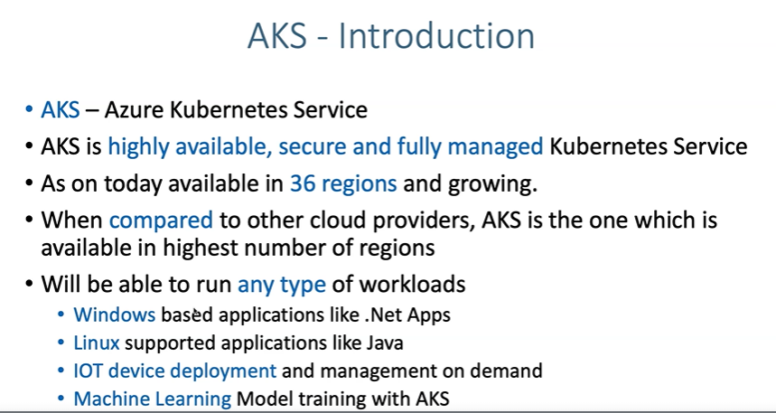
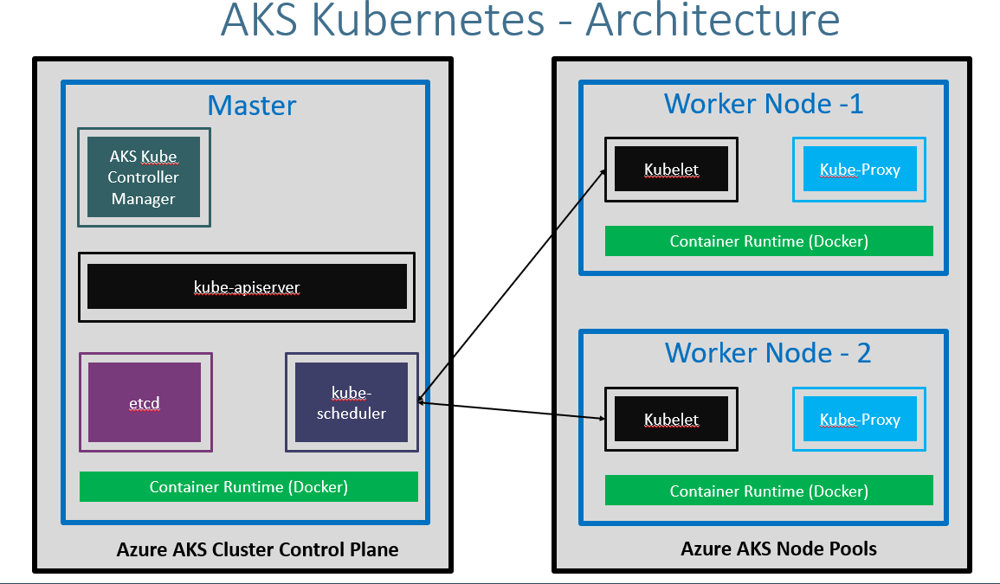

# Create AKS Cluster
## Introduction

## Very high level AKS Kubernets architecture

## Key words 
# In Azure AKS
* Azure AKS Cluster Control Plaine (Master Node Component)
* Azure AKS Node Pools (Worker Node Component)
## Master Node COmponents
*  **Container Runtime (Docker):** 
    - This is common across the Master and the worker Nodes. to runn our respective pods component present in side that master  

* **etcd**
    - ETCD Is Nothing But Consistently highly avillable key value store
    - Used as a kubernetes backing store for all cluster Data it stores all Master and Node information.

* **Kube-Sheduler:**
# In Regular Kubernets 
* Worker Nodes

# In EKS (aws)
* Managed Node Groups 